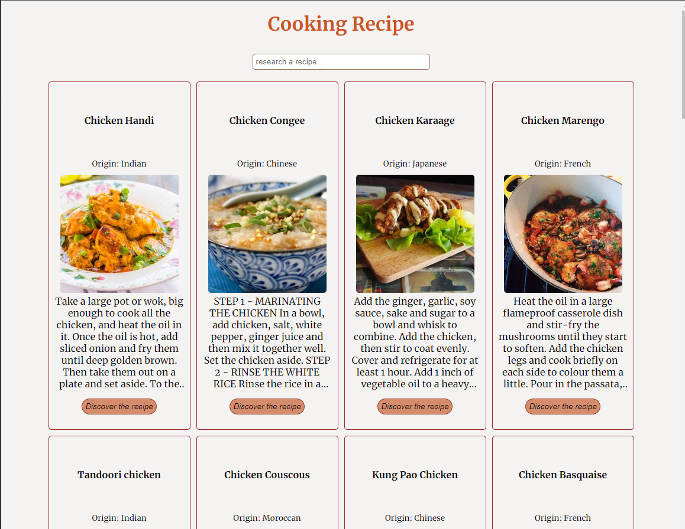
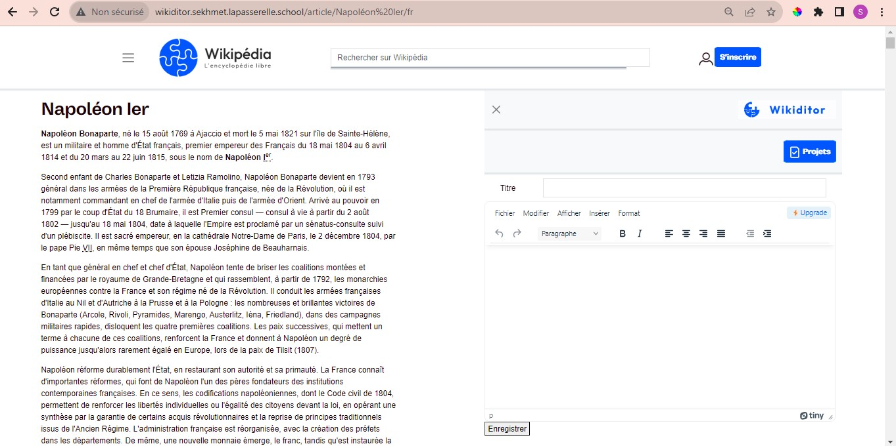

<!-- PRESENTATION -->
<h1 align="center">Hello 👋, I'm Sandrine</h1>
<h3 align="center">A web developer living in France.</h3>

- 🌱 I’m currently learning **React and TypeScript**

- 👯 I’m looking to **join a dynamic team where I can make a significant contribution. My goal is to collaborate on innovative projects that not only enrich me professionally, but also benefit the team and the company. I am motivated by challenges and willing to share my skills and experience to create impactful web solutions.**

- 👨‍💻 Some of my projects are available at [https://sunsand03.github.io./](https://sunsand03.github.io./)

- 💬 Ask me about **Javascript, React, SQL, HTML, CSS, PHP and Symfony.**

- 📫 How to reach me **sandrinenombo03@gmail.com**

<!-- SOCIAL MEDIA -->

<h3 align="left">Connect with me:</h3>

<!-- TECHNO -->

<h3 align="left">Languages and Tools :</h3>

 
Frontend: HTML | CSS | JavaScript | React | Next.js | SASS | TypeScript | Twig | Bootstrap
 
Backend : Node.js | SQL  | PHP | Symfony | Mongo DB | Python
 
Other :  Visual Basic for Applications (VBA) | PHPUnit | Figma
 
CMS : Wordpress
 

<!-- PROJECTS -->

<h2 align="center">Some of my projects</h2>

	<table>
		<tr>
      <td width="50%">
				<h3 align="center">Cooking Recipe</h3>
				
  
					
					 
					 
					

						  
		        
					

					
<strong>Next.js - React - JavaScript - CSS</strong>

          

						Cooking Recipe is a culinary recipe search application.
            Find your next meal here.
					

           
           
                               
				

			</td>
      			<td width="50%">
				<h3 align="center">Wikiditor</h3>
				
  
					
					 
					 
					

								
						</a>
					

					
<strong>PHP - Symfony - Twig - Bootstrap - Mongo</strong>

          

						Redesign of the Wikipedia site with the integration of a note-taking tool, the Wikiditor. The application allows you to view a Wikipedia article on the left and drag-and-drop excerpts from the article into the editor on the right. The user can then save their project or export it as a PDF.
					

				

			</td>       
    </tr>
    <tr>
      <td width="50%">
				<h3 align="center">Countries</h3>
				
  
					
					 
					 
					

								        
						</a>
					

					
<strong>Next.js - React - JavaScript - SASS</strong>

          

						Countries is an application that displays the various flags of countries around the world. By clicking on a flag, the user can access three pieces of information about the country: its name, the name of its capital, and its population. The user can sort the number of flags they want to see displayed or filter countries by continent.
					

           
           
                               
				

			</td>
      			<td width="50%">
				<h3 align="center">AzerType</h3>
				
  
					
					 
					 
					

						
            		
						</a>
					

					
<strong>JavaScript - HTML - CSS</strong>

          

						AzerType is an online application for learning to type faster on the keyboard. At the end of a session, the user sees their final score and average typing speed. They can share their final score by sending an email.
					

				

			</td>       
      </tr>			
	</table>

 
 

